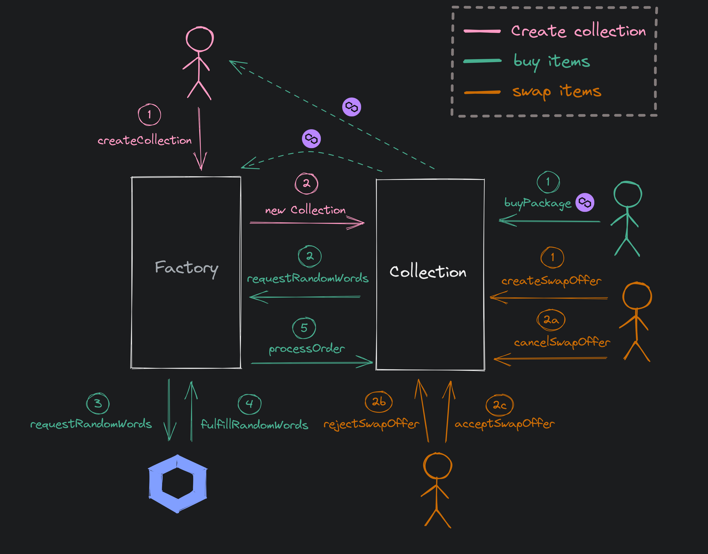

# gotSwapz Smart Contracts



## Factory contract

Mumbai: [0x4cd94a3f94b3cb6c623dff21437b1b5755c6df66](https://mumbai.polygonscan.com/address/0x4cd94a3f94b3cb6c623dff21437b1b5755c6df66#code)

Mainnet: [0x5d7addd96b0ca979b86e5eeb34b45b21cd671027](https://polygonscan.com/address/0x5d7addd96b0ca979b86e5eeb34b45b21cd671027#code)

## Setup

This project has been created with [**Foundry**](https://github.com/foundry-rs/foundry).

See the official Foundry installation [instructions](https://github.com/gakonst/foundry/blob/master/README.md#installation).

Then, install the [foundry](https://github.com/gakonst/foundry) toolchain installer (`foundryup`) with:

```bash
curl -L https://foundry.paradigm.xyz | bash
```

Now that you've installed the `foundryup` binary, anytime you need to get the latest `forge` or `cast` binaries, you can run:

```bash
foundryup
```

## Commands

| Description                               |        Command        |
| ----------------------------------------- | :-------------------: |
| Install dependencies                      |    `make install`     |
| Update dependencies                       |     `make update`     |
| Build all smart contracts                 |     `make build`      |
| Remove artifacts and cache directories    |     `make clean`      |
| Remove modules                            |     `make remove`     |
| Run all tests                             |     `make tests`      |
| Get tests coverage report                 |    `make coverage`    |
| Run Slither static analysis               |    `make slither`     |
| Create snapshot of each test's gas usage  |    `make snapshot`    |
| Create flattened version of the contracts |    `make flatten`     |
| Create inheritance graph of the contracts |  `make inheritance`   |
| Show summary of the contracts             |    `make summary`     |
| Show dependencies of the contracts        |  `make dependencies`  |
| Create local testnet node                 |     `make anvil`      |
| Deploy GotSwapzFactory to Anvil           |  `make deploy-anvil`  |
| Deploy GotSwapzFactory to Mumbai          | `make deploy-mumbai`  |
| Deploy GotSwapzFactory to Polygon         | `make deploy-mainnet` |

## License

Distributed under the MIT License. See [LICENSE](LICENSE) for more information.
